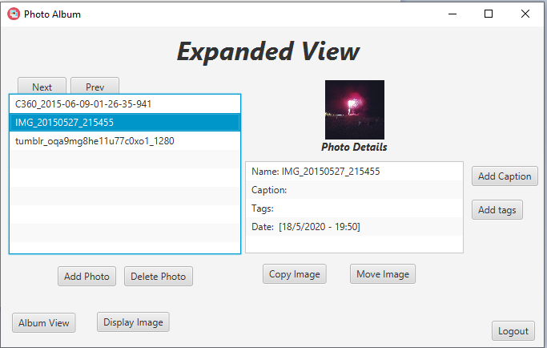

# Photo Album
Object starts from a  given location and reaches a target in least number of steps. The grid map is blocked in certain parts and it is the responsibility of the algorithm to determine, fine and traverse through the most optimized and available path on this grid (the algorithm determines the best route to get to the destination if the path not blocked on the grid).

  

## Installing & Running
Download the complete project in one folder, import project in your IDE, compile and run.
